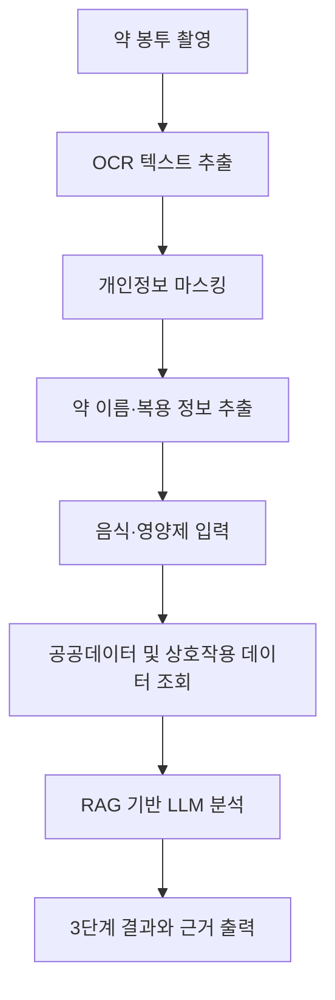

# PilloSuffer

> **복약 안전을 재정의하다.**  
> 약 봉투를 촬영하면, 내가 먹으려는 음식과 영양제가 현재 복용 중인 약과 함께 괜찮은지 한눈에 확인할 수 있도록 돕는 복약 안전 서비스입니다.

## 공개 저장소 안내

이 저장소는 **PilloSuffer 프로젝트 소개 및 발표 자료 기반 README**를 제공하기 위한 공개용 저장소입니다.  
서비스의 핵심 구현 코드와 내부 데이터 처리 로직은 핵심 기술 보호를 위해 공개 저장소에서 제외했습니다.

본 README는 다음 발표 자료를 기반으로 재구성했습니다.

- [아...뭐먹지 팀 발표자료](docs/pillosuffer-presentation.pdf)
- [발표대본](docs/pillosuffer-script.pdf)

## 발표 자료

프로젝트 발표 원본 자료도 함께 공개합니다.

| 문서 | 설명 |
| --- | --- |
| [pillosuffer-presentation.pdf](docs/pillosuffer-presentation.pdf) | 문제정의, 사용자 조사, 솔루션, 기술 구조, 검증 결과를 담은 팀 발표자료 |
| [pillosuffer-script.pdf](docs/pillosuffer-script.pdf) | 발표 흐름과 구두 설명을 정리한 발표대본 |

## 한 줄 소개

**PilloSuffer**는 약물과 음식/영양제 사이의 상호작용 정보를 사용자가 이해하기 쉬운 형태로 제공하는 AI 기반 복약 안전 서비스입니다.

서비스는 두 가지 사용자 경험을 중심으로 설계되었습니다.

- **뭐무꼬**: 노년층 사용자를 위한 쉬운 UI 버전
- **PilloSuffer**: 전 연령층을 대상으로 확장 가능한 복약 안전 플랫폼

## 문제의식

약을 먹는 사람에게 "무엇을 함께 먹어도 되는가"는 생각보다 어려운 문제입니다.  
특히 여러 약을 동시에 복용하는 고령층에게는 음식, 건강기능식품, 영양제가 약효나 부작용에 영향을 줄 수 있습니다.

발표 자료와 조사 과정에서 확인한 핵심 문제는 다음과 같습니다.

- 2024년 기준 강원도 고령화율은 **25.3%**로 매우 높은 수준입니다.
- HIRA 빅데이터 브리프 기준, 국내 65세 이상 노인 중 잠재적 부적절 약물 사용 경험 비율은 **80.96%**로 나타났습니다.
- 정기 약물 복용자의 상당수는 건강기능식품 병용 사실을 의료진에게 알리지 않습니다.
- 일본 치바대학교 연구에 따르면, 정기 약물 복용자의 **70.3%**가 건강기능식품 병용 사실을 의료진에게 알리지 않았습니다.
- 그 이유로 **"안전하다고 생각해서"**가 **73.1%**, **"묻지 않아서"**가 **15.6%**로 보고되었습니다.

PilloSuffer는 이처럼 **약물, 음식, 영양제 정보의 사각지대**에 놓인 사용자를 핵심 대상으로 합니다.

## 사용자 조사

팀은 강원 지역 노년층 다제복용 환자군을 대상으로 현장 조사를 진행했습니다.

- 조사 대상: 강원 지역 65세 이상 응답자
- 응답 수: **N = 19**
- 조사 목적: 약물-음식/영양제 상호작용 인식과 정보 탐색 장벽 확인

조사를 통해 설정한 네 가지 가설은 모두 지지되었습니다.

| 가설 | 대표 검증 데이터 | 결과 |
| --- | --- | --- |
| H1. 상호작용 인식이 부족하다 | 약-영양제 부작용 무지 **47.4%** | Supported |
| H2. 복약 정보 탐색 장벽이 존재한다 | 복약 정보 검색 곤란 **63.2%** | Supported |
| H3. 음식/영양제 복용 불안이 존재한다 | 음식/영양제 복용 불안 **68.4%** | Supported |
| H4. 구체적 위험 사례 인지가 낮다 | 자몽주스-혈압약 사례 무지 **57.9%** | Supported |

단, 본 조사는 모집단 명부 확보가 어려운 환경에서 편의표본추출로 진행되었습니다. 따라서 응답자 집단의 특성을 파악하는 데에는 유용하지만, 전체 노인 다제복용자를 대표하는 통계로 일반화하기에는 한계가 있습니다.

## 핵심 MVP

> **약 봉투를 촬영하면, 음식·영양제 상호작용 정보를 한눈에 본다.**

PilloSuffer의 MVP는 사용자가 복잡한 약 이름을 직접 입력하지 않아도 되도록 설계되었습니다.

1. 약 봉투를 촬영합니다.
2. OCR이 약 이름과 복용 정보를 추출합니다.
3. 개인정보는 즉시 마스킹합니다.
4. 사용자가 음식 또는 영양제를 입력하거나 촬영합니다.
5. 약-음식/영양제 상호작용 정보를 근거 기반으로 분석합니다.
6. 사용자가 이해하기 쉬운 자연어와 3단계 결과로 제공합니다.

## 주요 기능

### 약 봉투 OCR 스캔

- 스마트폰으로 약 봉투를 촬영합니다.
- OCR을 통해 약 이름, 함량, 투여 횟수, 투약 일수, 용법 정보를 추출합니다.
- 이름, 주민등록번호, 병원명, 전화번호 등 개인정보성 정보는 정규식 기반으로 마스킹합니다.
- 약이 아닌 안내 문구나 처방전 메타 정보는 최대한 제외합니다.

### 음식·영양제 입력

- 사용자가 먹으려는 음식 또는 영양제를 직접 입력합니다.
- 음식 사진 또는 영양제 사진 기반 자동 인식 흐름도 고려했습니다.
- 발표 자료 기준, 가공식품 DB **277,074건**을 활용한 검색 구조를 설계했습니다.

### 상호작용 분석

- 선택된 식품의 주요 영양소 정보를 함께 고려합니다.
- 비타민 K, 칼슘, 철분 등 약물과 상호작용 가능성이 있는 영양 성분을 분석 흐름에 포함합니다.
- 식약처 공공데이터와 해외 약물 상호작용 데이터를 결합해 근거를 구성합니다.
- 근거 기반 RAG 구조를 통해 LLM이 단순 추측이 아니라 제공된 문맥을 바탕으로 답변하도록 설계했습니다.

### 결과 제공

결과는 사용자가 직관적으로 이해할 수 있도록 3단계로 제공합니다.

| 단계 | 의미 |
| --- | --- |
| ✅ | 특별히 보고된 상호작용 정보가 없음 |
| ⚠️ | 주의가 필요할 수 있음 |
| ❌ | 병용 전 전문가 확인이 강하게 필요함 |

각 결과에는 다음 정보를 함께 제공합니다.

- 약 이름
- 음식/영양제 이름
- 판단 이유
- 근거 출처
- 전문가 상담 안내

### 즐겨찾기 및 히스토리

- 자주 먹는 약물을 저장합니다.
- 이전 복용 기록과 검사 결과를 다시 확인할 수 있도록 히스토리 구조를 설계했습니다.
- 노년층 사용자가 반복 입력 없이 사용할 수 있도록 단순한 흐름을 지향했습니다.

## 처리 흐름

## 기술 개요

핵심 구현 코드는 공개하지 않지만, 발표 자료 기준의 기술 구성은 다음과 같습니다.

| 영역 | 설명 |
| --- | --- |
| OCR | 약 봉투 이미지에서 한국어/영어 혼합 텍스트를 추출 |
| PII Masking | 이름, 주민번호, 병원명, 전화번호 등 민감 정보 제거 |
| Food DB | 가공식품 및 영양 성분 검색 데이터 활용 |
| Drug DB | 식약처 공공데이터와 DrugBank 기반 상호작용 데이터 결합 |
| RAG | 검색된 근거를 LLM 컨텍스트로 주입 |
| LLM | 낮은 temperature 설정으로 자유도를 낮추고 근거 기반 문장 생성 |
| UX | 노년층도 이해하기 쉬운 큰 글씨, 단순 단계, 명확한 결과 표시 |

## 데이터 아키텍처 요약

PilloSuffer는 단순히 "AI에게 물어보는 서비스"가 아니라, 외부 근거 데이터를 먼저 구성한 뒤 그 결과를 사용자가 이해하기 쉽게 설명하는 구조를 목표로 했습니다.

주요 데이터 흐름은 다음과 같습니다.

1. 약 봉투 OCR 결과에서 약품명을 추출합니다.
2. 약품명을 식약처 공공데이터와 연결해 성분 정보를 식별합니다.
3. 식별된 성분을 약물-음식 상호작용 데이터와 연결합니다.
4. 음식 또는 영양제의 주요 영양소 정보를 함께 고려합니다.
5. 검색된 근거를 LLM에 전달합니다.
6. LLM은 근거를 바탕으로 사람이 이해하기 쉬운 자연어 설명을 생성합니다.

## 리스크 대응

프로젝트 초기에는 세 가지 리스크를 중요하게 다뤘습니다.

### 1. 정확도

약물과 음식 상호작용 정보는 공개 데이터가 제한적입니다.  
팀은 식약처, 약학정보원, 관련 연구 자료를 검토하고, 국내 공공데이터와 해외 DrugBank 기반 데이터를 연결하는 방식으로 데이터 부족 문제를 보완했습니다.

### 2. 의료행위 오해 가능성

PilloSuffer는 진단이나 처방을 제공하는 서비스가 아닙니다.

- 결과를 의학적 단정으로 표현하지 않습니다.
- 복용 중단 또는 병용 지시를 직접 내리지 않습니다.
- 근거와 출처를 함께 제시합니다.
- 위험 가능성이 있으면 약사 또는 의사 상담을 안내합니다.

### 3. 개인정보

약 봉투에는 이름, 생년월일, 병원명, 전화번호 등 민감한 정보가 포함될 수 있습니다.

이를 줄이기 위해 다음 원칙을 적용했습니다.

- OCR 이후 개인정보성 텍스트를 즉시 마스킹합니다.
- 분석에 필요한 약 이름과 복용 정보만 남깁니다.
- 원본 이미지를 장기 저장하지 않는 방향으로 설계했습니다.

## 검증 결과

발표 자료 기준, PilloSuffer RAG 엔진은 약물-식품 조합 테스트에서 높은 정확도를 보였습니다.

- 평가 대상: **99개 약물-식품 조합**
- 유효 응답: **98개**
- 평가 방식: **3인 교차 검증**
- 우수 응답: **94건**
- 부분 정답: **4건**
- 오답/누락: **1건**
- 최종 정확도: **96.97%**

비교 지표는 다음과 같습니다.

| 평가 대상 | 전체 건수 | 우수 | 부분 정답 | 오답/누락 | 최종 정확도 |
| --- | ---: | ---: | ---: | ---: | ---: |
| PilloSuffer RAG 엔진 | 99건 | 94건 | 4건 | 1건 | **96.97%** |
| 약학정보원, N/A 제외 | 86건 | 74건 | 2건 | 10건 | 87.21% |
| 약학정보원, N/A 포함 | 99건 | 79건 | 2건 | 18건 | 80.81% |

## 사용자 경험 방향

팀은 특히 어르신들이 실제로 어떤 어려움을 겪는지에 집중했습니다.

- 어려운 약 이름을 직접 입력하지 않아도 되게 합니다.
- 촬영, 확인, 결과 확인까지 단계를 단순화합니다.
- 전문 용어보다 쉬운 설명을 우선합니다.
- 위험도는 색과 아이콘으로 빠르게 이해할 수 있게 합니다.
- "무엇을 먹으면 안 된다"보다 "어떤 점을 확인해야 한다"를 알려주는 방식으로 설계했습니다.

## 팀

| 이름 | 역할 | 소속 |
| --- | --- | --- |
| 성수한 | 팀장 / 기획·개발 | AI융합학과 |
| 한영수 | 데이터 분석 | AI융합학과 |
| 정지강 | PM 지원 / 시스템 테스트 | AI융합학과 |
| 이효경 | UI/UX | AI융합학과 |

## 프로젝트 메시지

PilloSuffer는 "복약 때문에 먹는 것까지 불안해지는 상황"을 줄이고자 시작된 프로젝트입니다.

약은 병을 치료하기 위해 먹지만, 약과 함께 먹는 음식이나 영양제를 알지 못하면 사용자는 다시 불안해집니다.  
PilloSuffer는 그 불안을 줄이기 위해, 복잡한 약물 정보를 사용자의 일상 언어로 번역하는 복약 안전 도구를 지향합니다.

> 복약으로 인해 스트레스를 받지 않는 그날까지, PilloSuffer가 함께하겠습니다.

## 주의사항

본 프로젝트는 복약 안전 정보 탐색을 돕기 위한 소프트웨어 프로젝트입니다.

- 결과는 참고 정보이며 의학적 판단을 대체하지 않습니다.
- 복용 중인 약을 중단하거나 변경하기 전에는 반드시 전문가에게 확인해야 합니다.
- 임산부, 소아, 고령자, 간·신장 질환자, 항응고제·항암제·면역억제제 복용자는 특히 전문가 상담이 필요합니다.
- 데이터 출처와 모델 응답에는 한계가 있을 수 있습니다.
