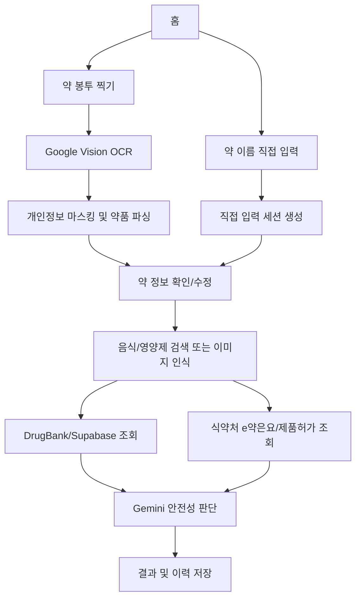

# PilloSuffer

PilloSuffer, 서비스명 **뭐무꼬**, 는 복용 중인 약과 음식/영양제를 함께 확인해 상호작용 가능성을 점검하는 모바일 우선 웹 애플리케이션입니다. 약 봉투 사진을 촬영하거나 약 이름을 직접 입력하고, 음식 또는 영양제를 검색/인식한 뒤 DrugBank 기반 데이터, 식약처 공공데이터, Gemini 기반 보조 판단을 함께 사용해 `safe`, `caution`, `danger` 단계로 안내합니다.

> 이 서비스는 참고용 복약 안전 확인 도구입니다. 실제 복용 변경, 중단, 병용 여부 판단은 반드시 약사 또는 의사에게 확인해야 합니다.

## 배포

- Production: [https://pillosuffer-v1.vercel.app](https://pillosuffer-v1.vercel.app)
- Repository: [https://github.com/jamessung644/Pillosuffer](https://github.com/jamessung644/Pillosuffer)
- 현재 배포 앱: `Pillosuffer_v1`
- Framework: Next.js App Router
- Hosting: Vercel

## 주요 기능

### 1. 약 봉투 OCR

- 사용자가 약 봉투 또는 처방 관련 이미지를 업로드합니다.
- Google Cloud Vision API의 `DOCUMENT_TEXT_DETECTION`으로 한글/영문 텍스트를 추출합니다.
- 추출된 텍스트에서 이름, 주민등록번호, 병원명, 전화번호 등 개인정보성 문자열을 마스킹합니다.
- 약품명, 용량, 복용 횟수, 투약 일수, 용법 정보를 정규식 기반으로 파싱합니다.
- OCR이 실패하거나 사진이 없을 때 `/manual` 화면에서 직접 약 정보를 입력할 수 있습니다.

### 2. 약 정보 확인 및 저장

- OCR 또는 직접 입력으로 얻은 약 목록을 사용자가 확인합니다.
- 잘못 인식된 약은 수정하거나 삭제할 수 있습니다.
- 약을 추가 입력할 수 있습니다.
- 저장 시 촬영/입력 세션 단위로 로컬 저장소에 기록됩니다.

### 3. 음식/영양제 검색 및 이미지 인식

- Supabase의 `processed_foods` 테이블에서 가공식품을 검색합니다.
- Supabase의 `supplements` 테이블에서 영양제를 검색합니다.
- Gemini Vision을 통해 음식 이미지에서 음식, 음료, 영양제, 약 품목명을 한국어 배열로 추출할 수 있습니다.

### 4. 약물-음식 안전성 확인

- 사용자의 약 목록과 음식/영양제 목록을 조합합니다.
- Supabase에 적재된 DrugBank 기반 상호작용 데이터에서 관련 근거를 조회합니다.
- 식약처 e약은요 API에서 복용금기, 병용금기, 경고사항, 부작용 정보를 조회합니다.
- 식약처 의약품 제품허가 API에서 약품의 공식 주성분과 분류를 조회합니다.
- Gemini LLM이 위 근거를 종합해 각 조합별 위험도를 안내합니다.
- 결과는 `safe`, `caution`, `danger` 중 하나로 표시됩니다.

### 5. 결과 화면 및 이력

- 종합 판정과 조합별 상세 이유를 표시합니다.
- 판단 근거 출처를 함께 표시합니다.
- 결과는 로컬 이력에 저장되어 다시 확인할 수 있습니다.
- 내 약 관리 화면에서 저장된 약 목록을 날짜별로 확인할 수 있습니다.

### 6. 로그인 및 동기화 기반

- Supabase Auth와 Google OAuth 기반 로그인 흐름이 포함되어 있습니다.
- 로그인 후 사용자 상태는 `AuthProvider`에서 관리합니다.
- 현재 핵심 약/검사 이력은 로컬 저장소 중심으로 동작하며, Supabase 기반 사용자 동기화 확장에 맞춘 구조를 갖고 있습니다.

## 기술 스택

| 영역 | 사용 기술 |
| --- | --- |
| Frontend | Next.js 14 App Router, React 18, TypeScript |
| Styling | Tailwind CSS |
| Auth | Supabase Auth, Google OAuth |
| Database | Supabase Postgres |
| OCR | Google Cloud Vision API |
| Food Recognition | Gemini Vision |
| Safety LLM | Gemini `gemini-3.1-flash-lite` |
| Public Data | 식약처 e약은요 API, 식약처 의약품 제품허가 API |
| Hosting | Vercel |

## 저장소 구조

```text
.
├── README.md                         # 저장소 및 앱 설명
├── index.html                        # GitHub Pages용 정적 보고서 진입점
├── PilloSuffer_개발보고서.html         # 프로젝트 개발 보고서
├── Pillosuffer_v1/                   # 현재 Vercel 배포 대상 Next.js 앱
│   ├── app/
│   │   ├── api/                      # OCR, 음식 인식, DB 조회, 안전성 판단 API
│   │   ├── auth/callback/            # Supabase OAuth callback
│   │   ├── drugs/                    # 인식된 약 확인/수정
│   │   ├── food/                     # 음식/영양제 선택
│   │   ├── login/                    # 로그인 화면
│   │   ├── manual/                   # 약 직접 입력
│   │   ├── my-meds/                  # 저장된 약 관리
│   │   ├── profile/                  # 사용자 정보
│   │   ├── result/                   # 안전성 결과
│   │   ├── scan/                     # 약 봉투 촬영/OCR
│   │   ├── globals.css               # Tailwind 전역 스타일
│   │   ├── layout.tsx                # 루트 레이아웃/메타데이터
│   │   └── page.tsx                  # 홈
│   ├── components/                   # 공통 UI 컴포넌트
│   ├── lib/                          # API 연동, OCR 파싱, 저장소, Supabase helper
│   ├── public/logo.svg               # 앱 로고
│   ├── types/                        # 공통 타입
│   ├── middleware.ts                 # Supabase session middleware
│   ├── package.json
│   └── .env.local.example
├── Pillosuffer_v2/                   # 실험/이전 버전 작업 폴더
├── Pillosuffer_v3/                   # 실험/이전 버전 작업 폴더
└── sql data/                         # 원천 데이터/실험 자료, Git 제외 대상
```

## 핵심 화면 흐름



## API Routes

| Route | Method | 역할 |
| --- | --- | --- |
| `/api/ocr` | `POST` | 이미지 파일을 Google Vision API로 보내 OCR 텍스트를 추출합니다. |
| `/api/food-recognize` | `POST` | 음식/영양제 이미지를 Gemini Vision으로 분석해 품목명을 반환합니다. |
| `/api/food-search` | `GET` | Supabase에서 가공식품과 영양제를 검색합니다. |
| `/api/mfds` | `POST` | DrugBank DB, 식약처 e약은요, 식약처 제품허가 정보를 병렬 조회합니다. |
| `/api/easy-drug` | `GET` | 단일 약품명에 대한 e약은요 및 제품허가 정보를 조회합니다. |
| `/api/safety-check` | `POST` | 조회된 근거와 사용자 입력을 Gemini에 전달해 안전성 결과를 생성합니다. |

## 데이터 및 판단 근거

### Supabase

앱은 Supabase에서 다음 계열 데이터를 조회합니다.

- `processed_foods`: 가공식품 검색용 데이터
- `supplements`: 영양제 검색용 데이터
- DrugBank 기반 약물-음식 상호작용 데이터

테이블명과 컬럼은 앱 코드의 Supabase query와 일치해야 합니다. Supabase RLS를 사용하는 경우, 브라우저에서 접근하는 anon role이 필요한 조회 권한을 갖도록 정책을 구성해야 합니다.

### 식약처 공공데이터

앱은 `MFDS_API_KEY` 하나로 다음 API를 호출합니다.

- e약은요 의약품개요정보: 효능, 사용법, 경고, 주의, 상호작용, 부작용 조회
- 의약품 제품허가정보: 약품의 공식 성분명, 분류, 제조사 조회

제품허가정보 API는 승인 직후 일시적으로 403 또는 빈 응답이 발생할 수 있습니다. 이 경우 앱은 회로 차단 방식으로 실패를 누적 관리하고, 가짜 성분 데이터를 만들지 않습니다.

### Gemini

Gemini는 두 곳에서 사용됩니다.

- 음식/영양제 이미지 인식
- 약물-음식 조합의 최종 안전성 판단

안전성 판단 프롬프트는 다음 원칙을 따릅니다.

- 식약처 e약은요 정보를 최우선 참고합니다.
- DrugBank 기반 DB 매칭을 보조 근거로 사용합니다.
- 공식 성분 식별 정보가 있는 경우 해당 성분을 기준으로 판단합니다.
- 근거가 없을 때는 약품을 추측하지 않습니다.
- 의학적 단정이나 복용 지시는 피하고 참고 정보 톤으로 안내합니다.

## 로컬 실행

### 1. 의존성 설치

```bash
cd Pillosuffer_v1
npm install
```

### 2. 환경변수 파일 생성

```bash
cp .env.local.example .env.local
```

`.env.local`에 필요한 값을 채웁니다.

```bash
GOOGLE_VISION_API_KEY=
GEMINI_API_KEY=
NEXT_PUBLIC_SUPABASE_URL=
NEXT_PUBLIC_SUPABASE_ANON_KEY=
MFDS_API_KEY=
```

### 3. 개발 서버 실행

```bash
npm run dev
```

기본 로컬 주소는 다음과 같습니다.

```text
http://localhost:3001
```

### 4. 프로덕션 빌드 확인

```bash
npm run build
```

## 환경변수

| 이름 | 공개 여부 | 필수 | 설명 |
| --- | --- | --- | --- |
| `GOOGLE_VISION_API_KEY` | 서버 전용 | OCR 사용 시 필수 | 약 봉투 OCR을 위한 Google Cloud Vision API 키 |
| `GEMINI_API_KEY` | 서버 전용 | 음식 인식/LLM 판단 시 필수 | Gemini Vision 및 안전성 판단 LLM 호출 키 |
| `NEXT_PUBLIC_SUPABASE_URL` | 브라우저 공개 | 필수 | Supabase 프로젝트 URL |
| `NEXT_PUBLIC_SUPABASE_ANON_KEY` | 브라우저 공개 | 필수 | Supabase anon key |
| `MFDS_API_KEY` | 서버 전용 | 식약처 조회 시 필수 | e약은요 및 의약품 제품허가정보 API 인증키 |

`NEXT_PUBLIC_` 접두사가 붙은 값은 브라우저 번들에 포함됩니다. Supabase anon key는 공개 클라이언트에서 쓰는 키이지만, 반드시 RLS와 정책을 올바르게 설정해야 합니다. `GOOGLE_VISION_API_KEY`, `GEMINI_API_KEY`, `MFDS_API_KEY`는 절대 클라이언트 코드나 공개 저장소에 노출하지 않습니다.

## Vercel 배포

### CLI 배포

```bash
cd Pillosuffer_v1
npm run build
npx vercel --prod --yes
```

### Vercel 환경변수

Vercel Project Settings의 Environment Variables에 아래 값을 등록합니다.

```text
GOOGLE_VISION_API_KEY
GEMINI_API_KEY
NEXT_PUBLIC_SUPABASE_URL
NEXT_PUBLIC_SUPABASE_ANON_KEY
MFDS_API_KEY
```

Production, Preview, Development 환경에 모두 등록해 두면 로컬 Vercel 개발, 미리보기 배포, 운영 배포의 동작 차이를 줄일 수 있습니다.

### Supabase Auth Redirect 설정

Google OAuth 로그인 후 Vercel 운영 도메인으로 돌아오려면 Supabase Dashboard의 Auth URL Configuration에 아래 값을 추가합니다.

```text
Site URL:
https://pillosuffer-v1.vercel.app

Redirect URLs:
https://pillosuffer-v1.vercel.app/auth/callback
https://pillosuffer-v1.vercel.app/**
http://localhost:3001/**
```

Preview 배포에서도 로그인을 테스트하려면 Vercel preview 도메인 패턴도 추가합니다.

```text
https://*-jamessung644s-projects.vercel.app/**
```

## 개인정보 보호 설계

- OCR 텍스트에서 주민등록번호, 이름, 병원/약국명, 전화번호, 처방전 교부번호 등을 마스킹합니다.
- 약품명과 복용 관련 정보만 후속 단계에 사용하도록 설계했습니다.
- 업로드 이미지는 서버에 영구 저장하지 않고 API 처리 흐름에서만 사용합니다.
- 약 목록과 결과 이력은 현재 브라우저 로컬 저장소 중심으로 저장됩니다.
- 로그인 기능은 포함되어 있으나, 사용자 데이터 동기화는 추가 확장 영역입니다.

## 보안 체크리스트

배포 또는 커밋 전 아래를 확인합니다.

- `.env`, `.env.local`, `.env.*` 파일을 커밋하지 않습니다.
- `.vercel`, `.next`, `node_modules`, `tsconfig.tsbuildinfo`를 커밋하지 않습니다.
- `sql data/`의 대용량 원천 데이터와 실험용 파일을 커밋하지 않습니다.
- 공개 저장소에 API 키가 노출되었다면 즉시 키를 재발급합니다.
- Supabase anon key를 사용하는 테이블에는 필요한 RLS 정책을 설정합니다.
- 의료 판단처럼 보일 수 있는 문구는 피하고, 참고 정보와 전문가 상담 안내를 유지합니다.

민감 정보 스캔 예시:

```bash
git ls-files --others --cached --exclude-standard \
  | xargs rg -n -S "(AIza[0-9A-Za-z_-]{20,}|sk-[0-9A-Za-z_-]{20,}|ghp_[0-9A-Za-z]{20,}|github_pat_[0-9A-Za-z_]{20,}|BEGIN (RSA|OPENSSH|EC|DSA)? ?PRIVATE KEY)" || true
```

## 개발 스크립트

`Pillosuffer_v1/package.json` 기준입니다.

| 명령 | 설명 |
| --- | --- |
| `npm run dev` | Next.js 개발 서버를 `3001` 포트로 실행합니다. |
| `npm run build` | 프로덕션 빌드를 생성하고 타입/라우팅 오류를 확인합니다. |
| `npm run start` | 빌드 결과를 Next.js production server로 실행합니다. |
| `npm run lint` | Next.js lint 명령을 실행합니다. |

## 문제 해결

### 로컬 화면이 HTML 기본 스타일처럼 보이는 경우

Next.js dev server의 CSS 캐시가 꼬인 상태일 수 있습니다.

```bash
lsof -nP -iTCP:3001 -sTCP:LISTEN
kill <PID>
npm run dev
```

브라우저에서 강력 새로고침을 실행합니다.

```text
macOS Safari/Chrome: Cmd + Shift + R
```

### 로그인 후 localhost로 이동하는 경우

Supabase Auth Redirect URL 설정이 운영 도메인을 허용하지 않는 상태일 가능성이 큽니다. Supabase Dashboard에서 `https://pillosuffer-v1.vercel.app/auth/callback`을 Redirect URL에 추가합니다.

### OCR이 실패하는 경우

- `GOOGLE_VISION_API_KEY`가 설정되어 있는지 확인합니다.
- Google Cloud에서 Vision API가 활성화되어 있는지 확인합니다.
- 업로드 이미지 용량과 형식을 확인합니다.

### 음식 이미지 인식 또는 안전성 판단이 실패하는 경우

- `GEMINI_API_KEY`가 설정되어 있는지 확인합니다.
- API key가 Gemini API 호출 권한을 갖는지 확인합니다.
- 앱은 Gemini 호출 실패 시 일부 안전성 판단을 mock caution 결과로 반환하도록 설계되어 있습니다.

### 식약처 데이터가 비어 있는 경우

- `MFDS_API_KEY`가 설정되어 있는지 확인합니다.
- data.go.kr에서 e약은요 및 의약품 제품허가정보 API 활용신청이 승인되었는지 확인합니다.
- 승인 직후에는 API 접근 권한 전파에 시간이 걸릴 수 있습니다.

## 한계와 주의사항

- OCR은 이미지 품질, 약 봉투 레이아웃, 조명, 글자 겹침에 따라 오인식될 수 있습니다.
- 약품 상품명과 성분명 매핑은 공공데이터 응답 품질과 검색 후보 생성 로직에 영향을 받습니다.
- DrugBank 기반 데이터와 식약처 공공데이터에 없는 조합은 Gemini 일반 지식에 의존할 수 있습니다.
- 결과는 의료적 확정 판단이 아니며 복약 결정을 대체하지 않습니다.
- 특히 임산부, 소아, 고령자, 간/신장 질환자, 항응고제/항암제/면역억제제 복용자는 반드시 전문가 확인이 필요합니다.

## 라이선스 및 사용 범위

현재 저장소는 개인/프로젝트 개발 목적의 애플리케이션입니다. 공공데이터, DrugBank 기반 데이터, 외부 API 사용 조건은 각 제공처의 라이선스와 이용 약관을 따릅니다.

